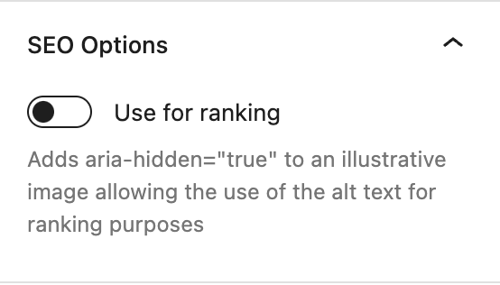
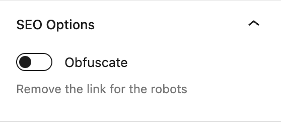
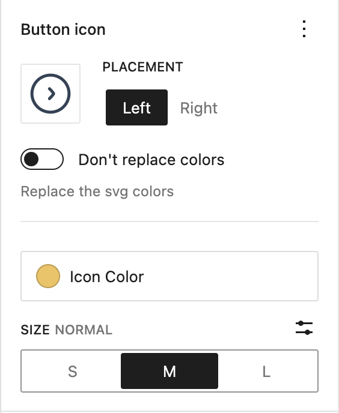
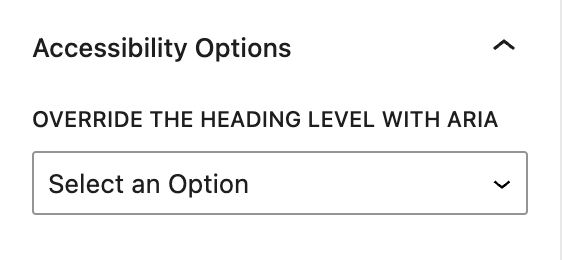

# Core Blocks Enhancer

Adds accessibility, SEO and performance options to the WordPress core blocks (Gutenberg), without replacing them.

The options show up in the block sidebar of the blocks you already use. Nothing changes on a block until you turn an option on, except for the two automatic enhancements (tables and YouTube embeds).

**[Documentation site](https://corentin-gautier.github.io/core-blocks-enhancer/)** · [Changelog](CHANGELOG.md)

## Features

| Block | What is added |
| --- | --- |
| Image, Media & Text | [Use the alt text for ranking](#use-images-for-ranking), [lazy loading](#lazy-loading) |
| Button, Paragraph | [Link obfuscation](#obfuscate-links) |
| Button | [Icon](#button-icon), [aria-label](#button-label) |
| Heading | [Aria heading level override](#heading-level) |
| Table | [`scope="col"` on header cells](#tables) (automatic) |
| YouTube embed | [Click-to-load placeholder](#youtube-embeds) (automatic) |

### Images

#### Use images for ranking

*Image and Media & Text blocks, "SEO & Performance" panel.*

Adds `aria-hidden="true"` to an illustrative image, so its alt text can be written for search engines without being read by assistive technologies.



#### Lazy loading

*Image block, "SEO & Performance" panel.*

Forces `loading="lazy"` on the image and removes any `fetchpriority` attribute.

### Obfuscate links

*Button and Paragraph blocks, "SEO Options" panel.*

Removes the links from the markup served to robots. Each `href` is replaced with a base64 encoded attribute, and a small front script opens the URL on click or on <kbd>Enter</kbd>:

```html
<a is="obf-link" role="link" tabindex="0" encoded-url="aHR0cHM6Ly9leGFtcGxlLmNvbQ==">Link</a>
```

Links stay focusable and Ctrl/Cmd + click opens them in a new tab. On a paragraph, the option applies to every link it contains.

The front script is disallowed in `robots.txt`. That rule targets `/wp-content/plugins/core-blocks-enhancer/`. If the plugin is installed elsewhere, as with Bedrock's `app/plugins`, add your own rule for `build/front.min.js`.



### Buttons

#### Button icon

*Button block, "Button icon" panel.*

Pick any image from the media library and place it left or right of the button text.

- **SVG icons** are used as a mask, so they can take a color or a gradient from the theme palette. Turn on "Don't replace colors" to keep the colors of the file.
- **Other images** are cropped to the icon size, with a 2x version for high density screens.
- **Size** is 16, 24 (default) or 32px, or any custom value.

The gap between the icon and the text can be changed with the `--button-gap` CSS custom property (8px by default). The button text is wrapped in a `span.wp-block-button__text`.



#### Button label

*Button block, "Accessibility" panel.*

Adds an `aria-label` to the button link.

### Heading level

*Heading block, "Accessibility Options" panel.*

Overrides the level announced to assistive technologies with `role="heading"` and `aria-level`, so a heading can look like an `h2` and be announced as an `h4`. "None" sets `role="presentation"` to take the heading out of the document outline.



### Tables

Every `<th>` of the Table block gets `scope="col"`.

### YouTube embeds

The YouTube iframe is replaced with a link showing the video thumbnail. The player is only loaded when the visitor clicks it, so nothing from the YouTube player is downloaded on page load.

- Supports `youtu.be/ID`, `youtube.com/watch?v=ID`, `/embed/ID`, `/shorts/ID` and `/live/ID` URLs.
- On connections slower than 4G (when the browser reports it), a low resolution thumbnail is used and the link opens YouTube in a new tab instead of loading the player.
- Ctrl/Cmd + click always opens the video on YouTube.

To run something before the player loads, such as asking for consent, define `window.onYoutubePlaceholderClick`. It receives the click event and must return a promise. The player loads when it resolves, and nothing happens if it rejects.

```js
window.onYoutubePlaceholderClick = (event) => new Promise((resolve, reject) => {
  hasConsent('youtube') ? resolve() : askConsent('youtube').then(resolve, reject);
});
```

### Text language

Setting the `lang` and `dir` of a text selection is handled by the core "Language" format since 1.9.0. Content created with the plugin's previous toolbar button (`<span lang="…">`) keeps its attributes when edited.

## Installation

Requires PHP 7.4 or later. The built files are committed, so there is no build step.

Whichever method you use, activate **Core Blocks Enhancer** in the Plugins screen afterwards.

### With Composer

The package is not on Packagist, so declare the GitHub repository first:

```sh
composer config repositories.core-blocks-enhancer vcs https://github.com/corentin-gautier/core-blocks-enhancer
composer require cgsoft/core-blocks-enhancer
```

The package type is `wordpress-plugin`. It is installed in your plugins folder if the project uses [composer/installers](https://github.com/composer/installers), as [Bedrock](https://roots.io/bedrock/) does, and in `vendor/` otherwise.

### With Git

```sh
cd wp-content/plugins
git clone https://github.com/corentin-gautier/core-blocks-enhancer.git
```

### As a zip

Run `npm install && npm run zip` and upload `core-blocks-enhancer.zip` from the Plugins screen.

## Development

```sh
npm install
npm run build   # editor script and styles (wp-scripts) + front script (rollup)
npm run test    # starts a local WordPress with wp-env
```

| Path | Content |
| --- | --- |
| `src/core/`, `src/custom/` | Editor side: block attributes and sidebar controls |
| `src/front/` | Front script: obfuscated links and YouTube placeholder |
| `lib/render.php` | Server side: `render_block` filters, one `render_{block_name}` method per block |
| `views/` | PHP templates |
| `docs/` | The documentation site, served by GitHub Pages |

Commits follow [Conventional Commits](https://www.conventionalcommits.org/), releases are cut with `npx standard-version`, which bumps the version in the plugin header, `composer.json` and `package.json`.

## License

[GPL-3.0](LICENSE)
